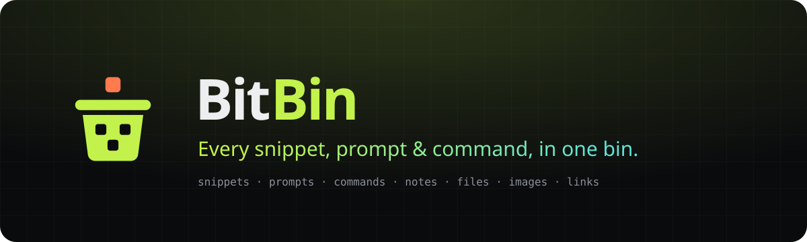

<p align="center">
  
</p>

<p align="center">
  <b>Every snippet, prompt &amp; command, in one bin.</b><br/>
  A fast, searchable home for developer knowledge.
</p>

<p align="center">
  
  
  
  
  
</p>

<p align="center">
  <a href="https://bitbin.divyanshuagrahari.dev"><b>bitbin.divyanshuagrahari.dev</b></a>
</p>

---

Developers keep their essentials scattered across editor snippets, browser bookmarks, chat threads, shell history and random folders. **BitBin** pulls all of it into one place: organized, tagged and a keystroke away.

## Features

**Core**
- Save code snippets, AI prompts, terminal commands, notes and links
- Upload files and images (Pro)
- Organize items into collections — an item can belong to many
- Pin, favorite and tag items for quick access
- Monaco code editor with syntax highlighting, and a markdown editor with GitHub-flavored preview
- Global command palette search (<kbd>⌘</kbd> / <kbd>Ctrl</kbd> + <kbd>K</kbd>)
- Dark-first "graphite + lime" interface with subtle motion

**AI (Pro)** — auto-tag suggestions, description generator, "Explain this code", prompt optimizer

**Save from anywhere (Pro)** — a Chrome / Edge extension: select text on any page, press <kbd>Ctrl</kbd> + <kbd>Shift</kbd> + <kbd>B</kbd>, and save it to BitBin. It guesses the type (snippet, command, note or link) and the snippet's language, takes the title from the page, and offers a collection picker, tags and AI tag suggestions. Download it from **Settings → Browser extension**. More in [`extension/`](extension/README.md).

**Platform**
- Email / password and GitHub sign-in, email verification and password reset
- Rate limiting on auth, uploads, AI and the token API
- Personal access tokens and a small `/api/v1` for the browser extension
- Stripe subscriptions (Free / Pro), file storage on Cloudflare R2
- Import and export (JSON on Free, ZIP with files on Pro)

## Architecture

BitBin is one Next.js 16 App Router application — no separate API server. Pages are React Server Components that read through Prisma; every write is a server action that checks the session, validates with Zod, applies plan and rate limits, and runs a query scoped to the user. Route handlers cover what needs real HTTP: auth flows, file transfer, export, and Stripe. The browser extension talks to a small token-authenticated `/api/v1` that reuses the same validation and queries ([ADR 0007](docs/architecture/decisions/0007-token-api-for-the-browser-extension.md)).

| Area | Choice |
|---|---|
| Framework | Next.js 16 (App Router), React 19, TypeScript 5 |
| Data | PostgreSQL (Neon) with Prisma 7 |
| Auth | NextAuth v5 — credentials + GitHub, JWT sessions |
| Styling | Tailwind CSS v4 + shadcn/ui |
| Services | OpenAI (or any OpenAI-compatible provider), Stripe, Cloudflare R2, Upstash Redis, Resend |
| Tests | Vitest |

More in the [architecture overview](docs/architecture/README.md) and the [tech stack](docs/tech-stack.md).

## Quick start

```bash
git clone https://github.com/Divyanshu2805/bitbin.git
cd bitbin
npm install
cp .env.example .env      # set DATABASE_URL and AUTH_SECRET at minimum
npm run db:migrate        # create the schema
npm run db:seed           # system item types + a demo account
npm run dev
```

Open <http://localhost:3000> and sign in as `demo@bitbin.dev` / `12345678`.

`.env.example` only holds `YOUR_…` placeholders; each optional service (GitHub, Resend, Upstash, R2, Stripe, OpenAI) switches on one area of the app. See [setup](docs/local-development/setup.md) and [configuration](docs/local-development/configuration.md).

## Deployment

Live at [bitbin.divyanshuagrahari.dev](https://bitbin.divyanshuagrahari.dev). Vercel builds every push to `main`; the database, storage, rate limiting and payments are managed services.

See [deployment](docs/deployment/README.md).

## Documentation

Everything lives in [`docs/`](docs/README.md):

| Section | Covers |
|---|---|
| [Local development](docs/local-development/README.md) | Prerequisites, setup, configuration, commands, troubleshooting |
| [Architecture](docs/architecture/README.md) | Layers, module map, request flows, security model, decisions |
| [Data model](docs/schema/README.md) | Tables, item types, conventions, migrations |
| [API reference](docs/api/README.md) | Route handlers, server actions, the token API, export format, errors and rate limits |
| [Browser extension](extension/README.md) | What it does, how users install it, loading it locally |
| [Engineering practices](docs/practices/README.md) | Conventions, guardrails, testing, design system, pitfalls |
| [Known gaps](docs/known-gaps/README.md) | Trade-offs, open issues and the roadmap |
| [Deployment](docs/deployment/README.md) | Vercel, provider callbacks, smoke test |

## Contributing

See [`CONTRIBUTING.md`](CONTRIBUTING.md). Security issues: [`SECURITY.md`](SECURITY.md). Changes by release are in [`CHANGELOG.md`](CHANGELOG.md).
