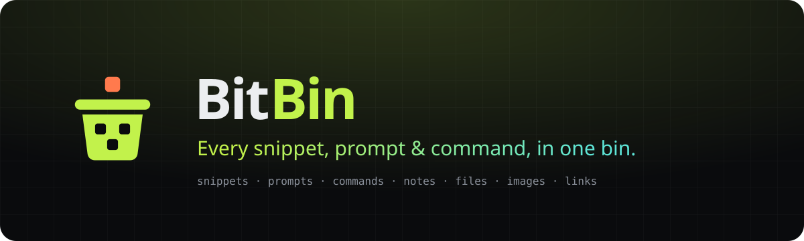
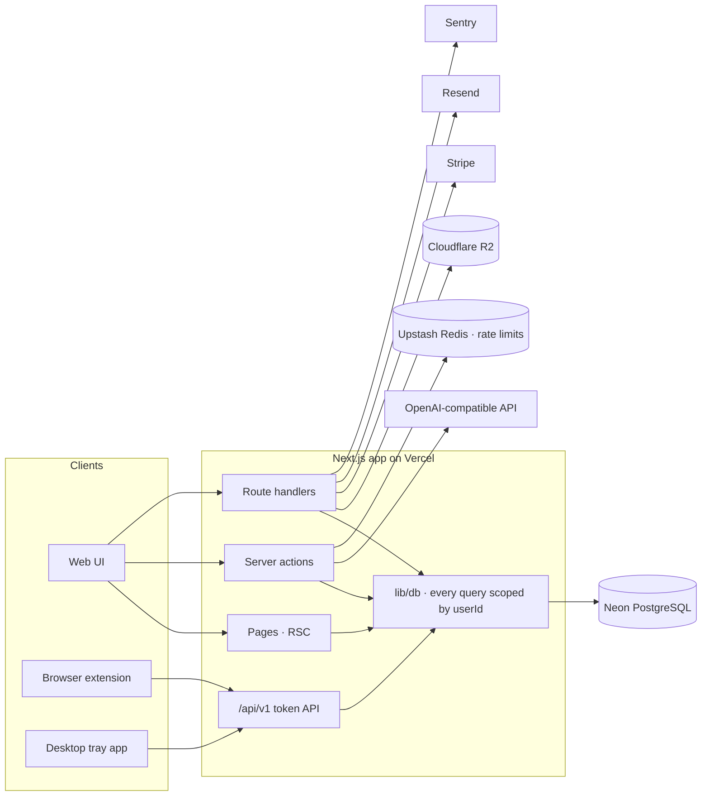

<p align="center">
  
</p>

<p align="center">
  <b>Every snippet, prompt &amp; command, in one bin.</b><br/>
  A fast, searchable home for developer knowledge.
</p>

<p align="center">
  <a href="https://github.com/Divyanshu2805/bitbin/actions/workflows/ci.yml"></a>
  
  
  
  
  
</p>

<p align="center">
  <a href="https://bitbin.divyanshuagrahari.dev"><b>bitbin.divyanshuagrahari.dev</b></a>
</p>

---

Developers keep their essentials scattered across editor snippets, browser bookmarks, chat threads, shell history and random folders. **BitBin** pulls all of it into one place: organized, tagged and a keystroke away.

## Try it

| | |
|---|---|
| **Live app** | [bitbin.divyanshuagrahari.dev](https://bitbin.divyanshuagrahari.dev) |
| **Demo login** | `demo@bitbin.dev` / `12345678` (a shared, public sandbox: the account can't change its own password, name or plan, and its library is reset every day) |
| **Your own account** | Register with an email: a verification link arrives from `noreply@bitbin.divyanshuagrahari.dev`. The sending domain is new, so **check your spam folder** if it doesn't show up |
| **Upgrading** | Production runs Stripe in **test mode**: use card `4242 4242 4242 4242`, any future date and any CVC. No money moves |

## Features

**Capture and organize**
- Seven item types: **snippets, prompts, commands, notes, links, files and images**
- Collections: an item can belong to many, collections can be pinned, and items can be dragged onto them
- Tags, favorites, pins, and a grid or list view that is remembered per browser
- Monaco code editor with language auto-detection, and a markdown editor with GitHub-flavored preview
- Global command palette search (<kbd>⌘</kbd> / <kbd>Ctrl</kbd> + <kbd>K</kbd>), plus keyboard shortcuts for everything (<kbd>N</kbd> new item, <kbd>C</kbd> new collection, <kbd>/</kbd> search, <kbd>?</kbd> for the full list)
- Dark-first "graphite + lime" interface, light theme available, motion that respects `prefers-reduced-motion`

**Save from anywhere (Pro)**

Two small companion apps get text into BitBin without opening it. Both talk to the same token-authenticated API ([`/api/v1`](docs/api/token-api.md)) with personal access tokens that are hashed, expiring and revocable from Settings.

| | Browser extension | Desktop tray app |
|---|---|---|
| Platform | Chrome and Edge (Manifest V3) | Windows, macOS and Linux (Electron) |
| Trigger | <kbd>Ctrl</kbd> + <kbd>Shift</kbd> + <kbd>B</kbd> (<kbd>⌘</kbd> + <kbd>Shift</kbd> + <kbd>B</kbd> on macOS), or right-click → *Save selection to BitBin* | <kbd>Ctrl</kbd> + <kbd>Alt</kbd> + <kbd>B</kbd> (<kbd>⌘</kbd> + <kbd>⌥</kbd> + <kbd>B</kbd> on macOS) from any app, or the tray icon |
| What it saves | The selected text on the page | The clipboard |
| Title and source | Taken from the page's heading and title, with a link back | Guessed from the text |
| Install | Download the ZIP from **Settings → Browser extension** and load it unpacked | Build or run it from [`desktop/`](desktop/README.md) |

**Browser extension** ([`extension/`](extension/README.md)): select text on any page and save it. It guesses the type (snippet, command, note or link) and the snippet's language, takes the title from the page, and offers a collection picker, tags, and a **✦ Suggest** button for AI tags and a description.

**Desktop tray app** ([`desktop/`](desktop/README.md)): lives in the system tray, and a global shortcut opens a small capture window with the clipboard ready to save.
- Guesses the item type from the text: a lone URL becomes a link, a shell line a command, code a snippet, anything else a note. The API detects a snippet's language.
- The same collection picker, tags and **✦ Suggest** (AI tags and description) as the extension; the last collection used is remembered.
- A tray menu with **Save clipboard to BitBin**, **New item** (a blank form), **Open BitBin**, **Settings**, **Start at login** and **Quit**. Closing a window hides it and the app keeps running; starting it a second time reopens the capture window.
- A settings window to connect with a token (checked against `GET /api/v1/me` before it is stored), pick the site, and change the shortcut if another app already holds it.
- Secure by design: the token stays in the main process and is stored encrypted with the OS keychain (`safeStorage`) where one exists; the windows run sandboxed with context isolation and no Node, and can't navigate or open other windows.
- Text only for now (files and images need the web app), builds are unsigned and there's no auto-update yet. Run it with `cd desktop && npm install && npm start`, or build an installer with `npm run dist`; its tests run with `npm test` there. How it works: [save from the desktop](docs/architecture/flows/save-from-desktop.md).

**AI (Pro)** — auto-tag suggestions, a description generator, "Explain this code" and a prompt optimizer, on OpenAI or any OpenAI-compatible provider.

**Your data stays yours**
- Import and export: JSON for everyone, and a ZIP for Pro that also holds your snippets, prompts, commands and notes as readable files plus every uploaded binary
- Account deletion removes your items, files and subscription

### Plans

| | Free | Pro ($8 / month or $72 / year) |
|---|---|---|
| Items / collections | 50 / 3 | Unlimited |
| Snippets, prompts, commands, notes, links | ✓ | ✓ |
| Files and images | | ✓ |
| AI helpers | | ✓ |
| Extension, desktop app and token API | | ✓ |
| JSON export / ZIP export | JSON | JSON and ZIP |

Limits are enforced on the server (under a row lock, so concurrent requests can't overshoot them); the UI only mirrors them.

## Architecture

BitBin is one Next.js 16 App Router application with no separate API server. Pages are React Server Components that read through Prisma. Every UI write is a **server action** that checks the session, validates with Zod, applies plan and rate limits, and runs a query scoped to the signed-in user. Route handlers exist only where real HTTP is needed: auth flows, file transfer, export, Stripe, and the token API used by the extension and the desktop app.


```mermaid
flowchart LR
  subgraph Clients
    W[Web UI]
    X[Browser extension]
    D[Desktop tray app]
  end
  subgraph "Next.js app on Vercel"
    P[Pages · RSC]
    A[Server actions]
    R[Route handlers]
    T["/api/v1 token API"]
    L["lib/db · every query scoped by userId"]
  end
  W --> P
  W --> A
  W --> R
  X --> T
  D --> T
  P --> L
  A --> L
  R --> L
  T --> L
  L --> DB[(Neon PostgreSQL)]
  R --> S3[(Cloudflare R2)]
  R --> ST[Stripe]
  A --> AI[OpenAI-compatible API]
  R --> RS[Resend]
  A --> UP[(Upstash Redis · rate limits)]
  R --> SE[Sentry]
```

| Area | Choice |
|---|---|
| Framework | Next.js 16 (App Router), React 19 with the React Compiler, TypeScript 5 |
| Data | PostgreSQL (Neon) with Prisma 7 and the `pg` driver adapter; 7 migrations |
| Auth | NextAuth v5: credentials and GitHub, JWT sessions that can be revoked |
| Styling | Tailwind CSS v4 + shadcn/ui |
| Services | OpenAI (or compatible), Stripe, Cloudflare R2, Upstash Redis, Resend, Sentry |
| Quality | Vitest, ESLint, GitHub Actions CI, Dependabot |

More in the [architecture overview](docs/architecture/README.md), the [decision records](docs/architecture/decisions/README.md) and the [tech stack](docs/tech-stack.md).

## Security

The rules are written down in the [security guardrails](docs/practices/security-guardrails.md) and the [security model](docs/architecture/security-model.md). In short:

- **Tenant isolation in code:** the user id comes only from the session (or the API token), every query is scoped by it, and any id or file URL from the client is checked for ownership. Another user's row looks exactly like a missing one.
- **Accounts:** bcrypt (cost 12), hashed and single-use email tokens, revocable sessions, identical answers whether or not an email has an account, rate limits on every public auth endpoint, and an open-redirect-safe sign-in.
- **Files** live in a private R2 bucket and are read only through an ownership-checked route; uploads are checked by extension, type, size and file signature.
- **Payments:** the Stripe webhook verifies the raw body's signature and syncs the plan from Stripe, so retried or out-of-order events are harmless.
- **Operations:** security headers, Sentry with personal data stripped, scripts that refuse to touch a production database, a production dependency audit in CI, Dependabot and secret scanning.
- **Review:** an internal audit found and fixed about 26 issues (5 critical or high); the history is in [security gaps](docs/known-gaps/security-gaps.md).

## Quality

| | |
|---|---|
| Tests | 600+ unit tests across 57 files (actions, library code and every route handler), all external services mocked; the desktop app has its own `node:test` suites |
| Coverage | about 81% of statements over `src/actions`, `src/lib` and `src/app/api`, with a floor enforced in CI |
| CI | audit, lint, tests with the coverage floor and a build on every push and pull request |
| Lighthouse (production build) | accessibility 100, SEO 100, best practices 96, performance 80–95 across 12 pages |
| Concurrency | the Free-plan limits and single-use email links are covered by race tests |

Details and what is checked by hand are in [testing](docs/practices/testing.md); every figure, and how to re-measure it, is on the [metrics page](docs/metrics.md).

## Quick start

Requires Node 20+ (CI uses 22) and a PostgreSQL database (a free [Neon](https://neon.tech) project works).

```bash
git clone https://github.com/Divyanshu2805/bitbin.git
cd bitbin
npm install
cp .env.example .env      # set DATABASE_URL and AUTH_SECRET at minimum
npm run db:migrate        # create the schema
npm run db:seed           # system item types + the demo account
npm run dev
```

Open <http://localhost:3000> and sign in as `demo@bitbin.dev` / `12345678`.

`.env.example` only holds `YOUR_…` placeholders; each optional service (GitHub, Resend, Upstash, R2, Stripe, OpenAI, Sentry) switches on one area of the app, and the app runs without them. See [setup](docs/local-development/setup.md) and [configuration](docs/local-development/configuration.md).

### Commands

```bash
npm run dev               # dev server on http://localhost:3000
npm run lint && npm run test && npm run build   # before every push (CI runs these too)
npm run test:coverage     # tests plus a coverage report; fails below the floor
npm run db:migrate        # schema change → new migration (never db push)
npm run db:seed           # system item types + the demo account
```

The full list is in [commands](docs/local-development/commands.md).

## Repository layout

```
src/app/            pages and route handlers (App Router)
src/actions/        server actions: every write from the UI
src/lib/            validation, plan limits, rate limits, integrations, db/ (every query)
src/components/     UI: shadcn primitives, layout, items, dashboard, homepage
prisma/             schema, migrations, seed and the demo library
extension/          Chrome / Edge extension (plain JS, outside the Next build)
desktop/            Electron tray app (plain CommonJS, own package.json)
docs/               documentation
.github/            CI workflow and Dependabot config
```

## Deployment

Live at [bitbin.divyanshuagrahari.dev](https://bitbin.divyanshuagrahari.dev). Vercel builds and deploys every push to `main`; the database (Neon), storage (Cloudflare R2), rate limiting (Upstash) and payments (Stripe) are managed services, and a Vercel cron resets the demo account daily. Migrations are applied by hand before a deploy that needs them. GitHub Actions runs the checks in parallel, without gating the deploy.

See [deployment](docs/deployment/README.md) and the [smoke test](docs/deployment/smoke-test.md).

## Known limitations and roadmap

Deliberately not built yet, and each a reasonable next step: end-to-end tests, per-device sessions and "sign out everywhere", email change and OAuth account linking, tag management, ZIP import and custom item types, server-side search for very large libraries, presigned download URLs, a full `script-src` CSP, payment-failure emails, Stripe live mode, publishing the extension to the Chrome Web Store (and a Firefox build), signed and auto-updating desktop builds, and sharing. The full, prioritised list with fixes is in [known gaps](docs/known-gaps/README.md); light-theme contrast hasn't been audited, and the legal pages are generic rather than lawyer-reviewed.

## Documentation

Everything lives in [`docs/`](docs/README.md):

| Section | Covers |
|---|---|
| [Local development](docs/local-development/README.md) | Prerequisites, setup, configuration, commands, troubleshooting |
| [Architecture](docs/architecture/README.md) | Layers, module map, request flows, security model, decision records |
| [Data model](docs/schema/README.md) | Tables, item types, conventions, migrations |
| [API reference](docs/api/README.md) | Route handlers, server actions, the token API, export format, errors and rate limits |
| [Browser extension](extension/README.md) · [Desktop app](desktop/README.md) | What they do, installing, running locally |
| [Engineering practices](docs/practices/README.md) | Conventions, guardrails, testing and CI, design system, pitfalls, definition of done |
| [Project metrics](docs/metrics.md) | Measured quality, accessibility, security and scale figures |
| [Known gaps](docs/known-gaps/README.md) | Trade-offs, open issues, the roadmap and the remaining-work checklist |
| [Deployment](docs/deployment/README.md) | Vercel, CI, provider callbacks, smoke test |

## License

Released under the [MIT License](LICENSE).

## Legal

[Privacy Policy](https://bitbin.divyanshuagrahari.dev/privacy) · [Terms of Service](https://bitbin.divyanshuagrahari.dev/terms)
